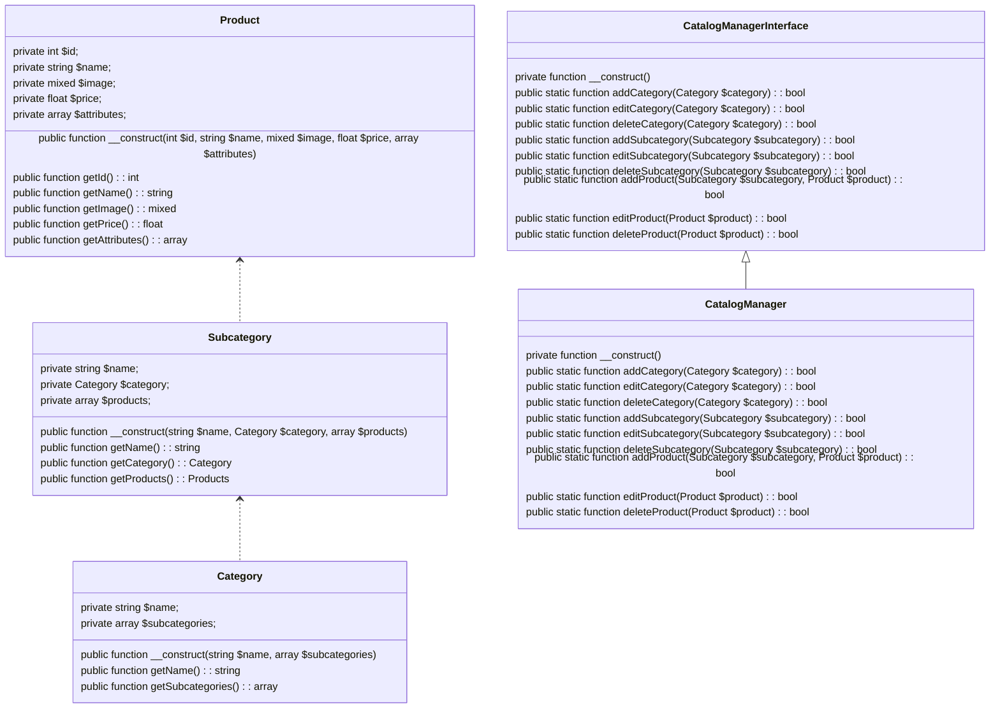
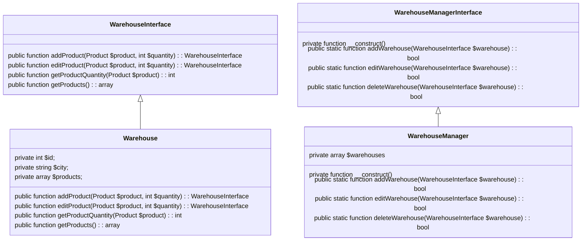
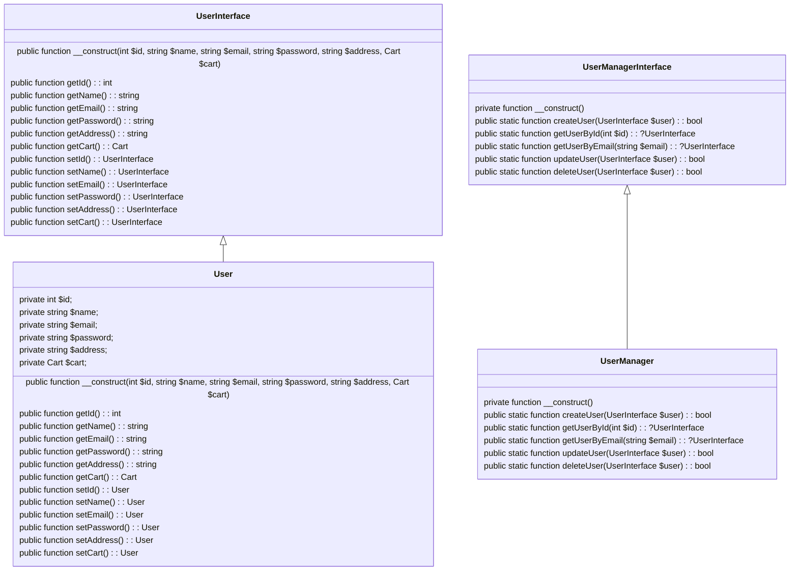
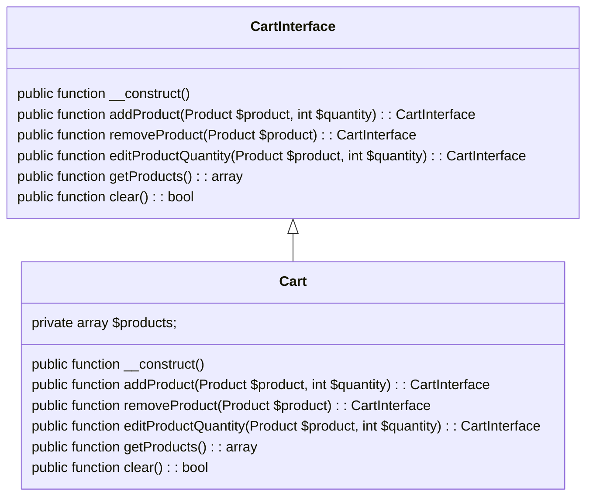
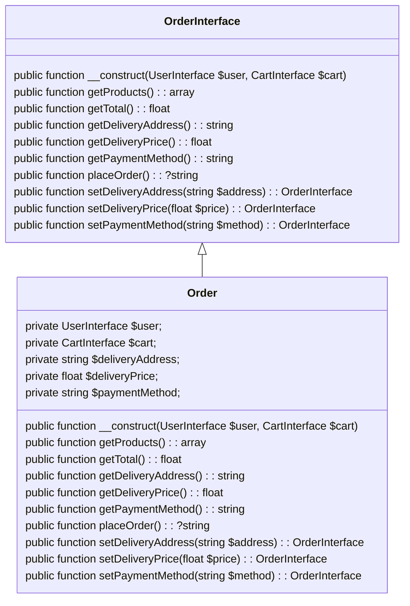
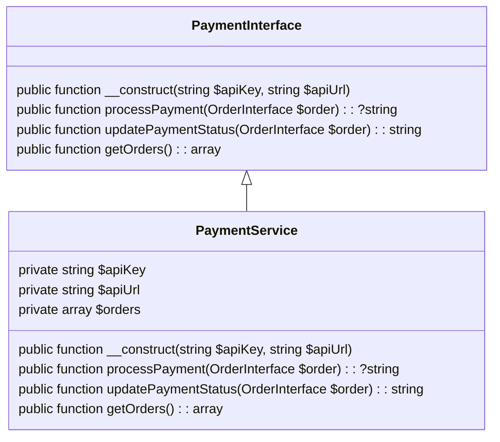

# Схема объектов

### Товары

```mermaid
classDiagram
    class Category {
        private string $name;
        private array $subcategories;

        public function __construct(string $name, array $subcategories)
        public function getName(): string
        public function getSubcategories(): array
    }

    Subcategory <.. Category

    class Subcategory {
        private string $name;
        private Category $category;
        private array $products;

        public function __construct(string $name, Category $category, array $products)
        public function getName(): string
        public function getCategory(): Category
        public function getProducts(): Products
    }

    Product <.. Subcategory

    class Product {
        private int $id;
        private string $name;
        private mixed $image;
        private float $price;
        private array $attributes;

        public function __construct(int $id, string $name, mixed $image, float $price, array $attributes)
        public function getId(): int
        public function getName(): string
        public function getImage(): mixed
        public function getPrice(): float
        public function getAttributes(): array
    }

    class CatalogManagerInterface {
        private function __construct()
        public static function addCategory(Category $category): bool
        public static function editCategory(Category $category): bool
        public static function deleteCategory(Category $category): bool
        public static function addSubcategory(Subcategory $subcategory): bool
        public static function editSubcategory(Subcategory $subcategory): bool
        public static function deleteSubcategory(Subcategory $subcategory): bool
        public static function addProduct(Subcategory $subcategory, Product $product): bool
        public static function editProduct(Product $product): bool
        public static function deleteProduct(Product $product): bool
    }

    CatalogManagerInterface <|-- CatalogManager

    class CatalogManager {
        private function __construct()
        public static function addCategory(Category $category): bool
        public static function editCategory(Category $category): bool
        public static function deleteCategory(Category $category): bool
        public static function addSubcategory(Subcategory $subcategory): bool
        public static function editSubcategory(Subcategory $subcategory): bool
        public static function deleteSubcategory(Subcategory $subcategory): bool
        public static function addProduct(Subcategory $subcategory, Product $product): bool
        public static function editProduct(Product $product): bool
        public static function deleteProduct(Product $product): bool
    }
```

### Склады

```mermaid
classDiagram
    class WarehouseInterface {
        public function addProduct(Product $product, int $quantity): WarehouseInterface
        public function editProduct(Product $product, int $quantity): WarehouseInterface
        public function getProductQuantity(Product $product): int
        public function getProducts(): array
    }

   WarehouseInterface <|-- Warehouse

    class Warehouse {
        private int $id;
        private string $city;
        private array $products;

        public function addProduct(Product $product, int $quantity): WarehouseInterface
        public function editProduct(Product $product, int $quantity): WarehouseInterface
        public function getProductQuantity(Product $product): int
        public function getProducts(): array
    }

    class WarehouseManagerInterface {
        private function __construct()
        public static function addWarehouse(WarehouseInterface $warehouse): bool
        public static function editWarehouse(WarehouseInterface $warehouse): bool
        public static function deleteWarehouse(WarehouseInterface $warehouse): bool
    }

    WarehouseManagerInterface <|-- WarehouseManager

    class WarehouseManager {
        private array $warehouses

        private function __construct()
        public static function addWarehouse(WarehouseInterface $warehouse): bool
        public static function editWarehouse(WarehouseInterface $warehouse): bool
        public static function deleteWarehouse(WarehouseInterface $warehouse): bool
    }
```

### Пользователь

```mermaid
classDiagram
    class UserInterface {
        public function __construct(int $id, string $name, string $email, string $password, string $address, Cart $cart)
        
        public function getId(): int
        public function getName(): string 
        public function getEmail(): string 
        public function getPassword(): string
        public function getAddress(): string
        public function getCart(): Cart

        public function setId(): UserInterface
        public function setName(): UserInterface 
        public function setEmail(): UserInterface 
        public function setPassword(): UserInterface
        public function setAddress(): UserInterface
        public function setCart(): UserInterface
    }

    UserInterface <|-- User

    class User {
        private int $id;
        private string $name;
        private string $email;
        private string $password;
        private string $address;
        private Cart $cart;

        public function __construct(int $id, string $name, string $email, string $password, string $address, Cart $cart)

        public function getId(): int
        public function getName(): string 
        public function getEmail(): string 
        public function getPassword(): string
        public function getAddress(): string
        public function getCart(): Cart

        public function setId(): User
        public function setName(): User 
        public function setEmail(): User 
        public function setPassword(): User
        public function setAddress(): User
        public function setCart(): User
    }

    class UserManagerInterface {
        private function __construct()
        public static function createUser(UserInterface $user): bool
        public static function getUserById(int $id): ?UserInterface
        public static function getUserByEmail(string $email): ?UserInterface
        public static function updateUser(UserInterface $user): bool
        public static function deleteUser(UserInterface $user): bool
    }

    UserManagerInterface <|-- UserManager

    class UserManager {
        private function __construct()
        public static function createUser(UserInterface $user): bool
        public static function getUserById(int $id): ?UserInterface
        public static function getUserByEmail(string $email): ?UserInterface
        public static function updateUser(UserInterface $user): bool
        public static function deleteUser(UserInterface $user): bool
    }
```

### Корзина

```mermaid
classDiagram
    class CartInterface {
        public function __construct()
        public function addProduct(Product $product, int $quantity): CartInterface
        public function removeProduct(Product $product): CartInterface
        public function editProductQuantity(Product $product, int $quantity): CartInterface
        public function getProducts(): array
        public function clear(): bool
    }

    CartInterface <|-- Cart

    class Cart {
        private array $products;

        public function __construct()
        public function addProduct(Product $product, int $quantity): CartInterface
        public function removeProduct(Product $product): CartInterface
        public function editProductQuantity(Product $product, int $quantity): CartInterface
        public function getProducts(): array
        public function clear(): bool
    }
    
```

### Оформление заказа

```mermaid
classDiagram
    class OrderInterface {
        public function __construct(UserInterface $user, CartInterface $cart)
        public function getProducts(): array
        public function getTotal(): float
        public function getDeliveryAddress(): string
        public function getDeliveryPrice(): float
        public function getPaymentMethod(): string
        public function placeOrder(): ?string

        public function setDeliveryAddress(string $address): OrderInterface
        public function setDeliveryPrice(float $price): OrderInterface
        public function setPaymentMethod(string $method): OrderInterface
    }

    OrderInterface <|-- Order 

    class Order {
        private UserInterface $user;
        private CartInterface $cart;
        private string $deliveryAddress;
        private float $deliveryPrice;
        private string $paymentMethod;

        public function __construct(UserInterface $user, CartInterface $cart)
        public function getProducts(): array
        public function getTotal(): float
        public function getDeliveryAddress(): string
        public function getDeliveryPrice(): float
        public function getPaymentMethod(): string
        public function placeOrder(): ?string

        public function setDeliveryAddress(string $address): OrderInterface
        public function setDeliveryPrice(float $price): OrderInterface
        public function setPaymentMethod(string $method): OrderInterface
    }
```

### Оплата заказа на внешней системе оплаты

```mermaid
classDiagram
    class PaymentInterface {
        public function __construct(string $apiKey, string $apiUrl)
        public function processPayment(OrderInterface $order): ?string
        public function updatePaymentStatus(OrderInterface $order): string
        public function getOrders(): array
    }

    PaymentInterface <|-- PaymentService

    class PaymentService {
        private string $apiKey
        private string $apiUrl
        private array $orders

        public function __construct(string $apiKey, string $apiUrl)
        public function processPayment(OrderInterface $order): ?string
        public function updatePaymentStatus(OrderInterface $order): string
        public function getOrders(): array
    }
```